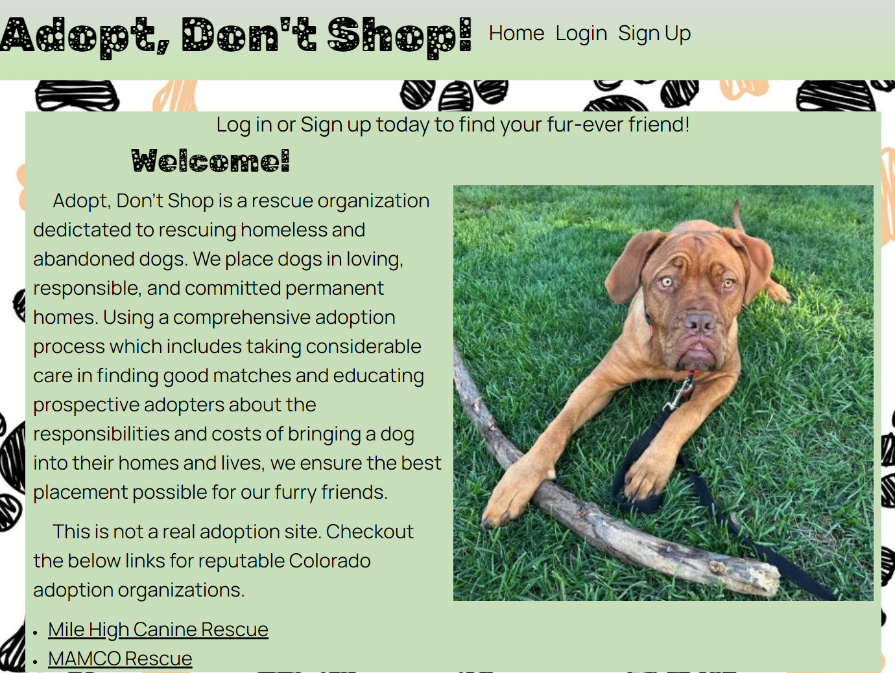
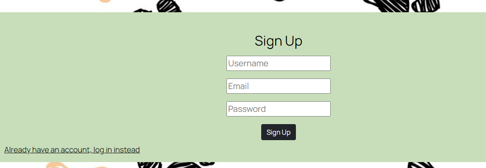
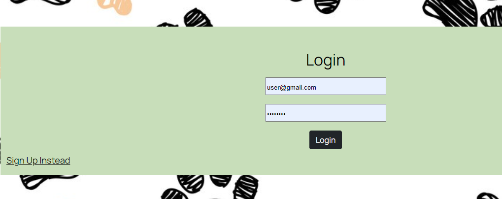
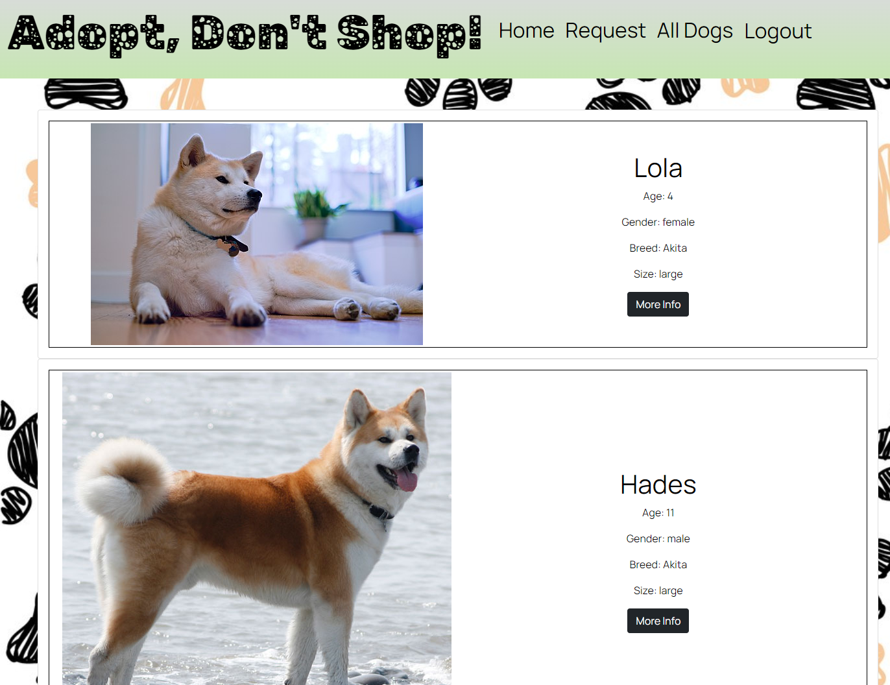
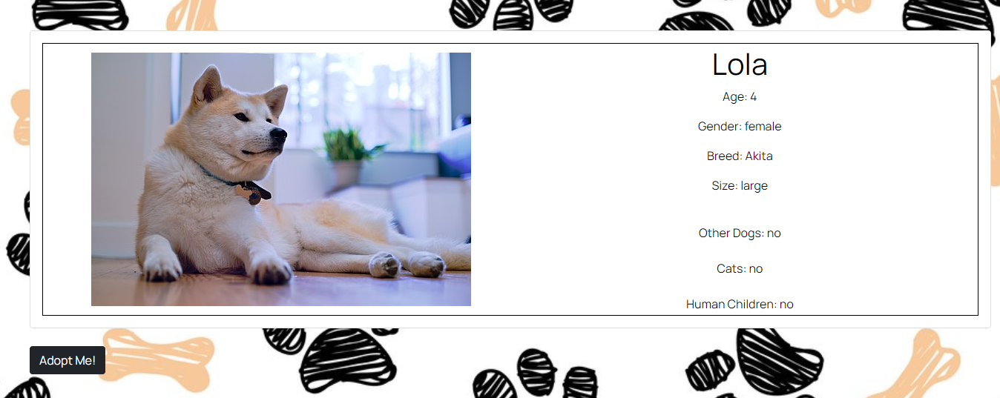
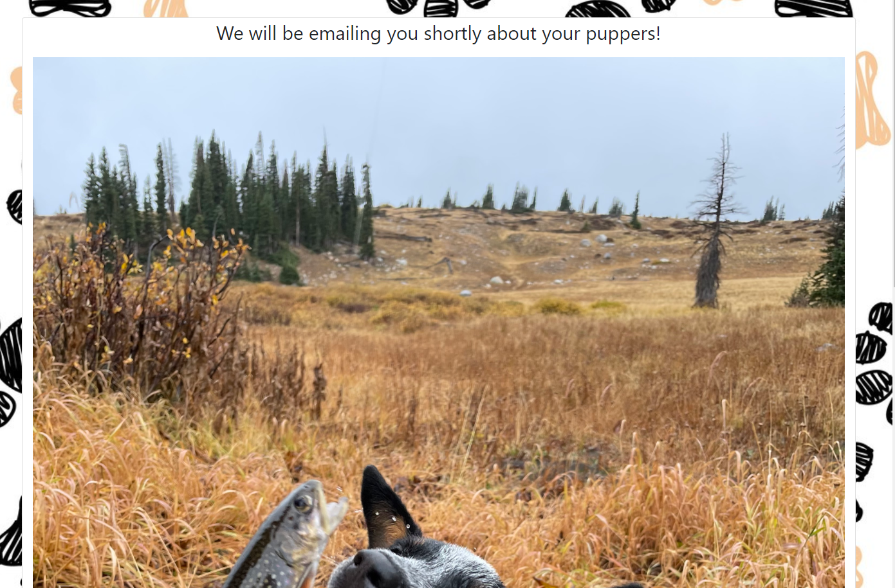

# Adopt Don't Shop!
 
## Description

The Adopt, Don't Shop is a fullstack web application that allows users to search for adoptable dogs in a MySQL database.  Users must first sign up, then can log in to browse the dogs.  If the current dogs do not fit the adoptees wants, the user can submit a form to be contacted at a later date when a dog comes in that is is a good fit for their home. Bow-wow!  

## User Story

As a non-profit dog rescue organization

I want an easy to use, appealing website 

So that potential adoptees can browse available dogs and apply to adopt dogs that will fit their lifestyle

## Installation

To install the project follow these steps:

1. Clone the application from GitHub with:
 * git clone [clone link from GitHub]

2. From the root folder, install the dependencies with:
 * npm install

3. Run the app with:
 * node server.js

## Usage

Access the deployed application with the Heroku link: 

![Request]

## Technologies / Libraries / APIs

* Node.js
* Express.js
* Express Handlebars
* MySql
* Sequelize
* Bcrypt
* Dotenv
* Fetch
* Dog API (https://dog.ceo/dog-api)

## Collaborators

Anna [GitHub](https://github.com/annapng)
David [GitHub](https://github.com/CaptureB)
Jacob [GitHub](https://github.com/jpick77)
Wyatt [GitHub](https://github.com/wjg97)
Katie [GitHub](https://github.com/KateRitchie)